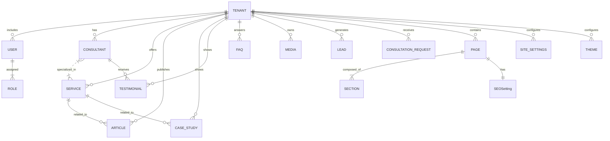
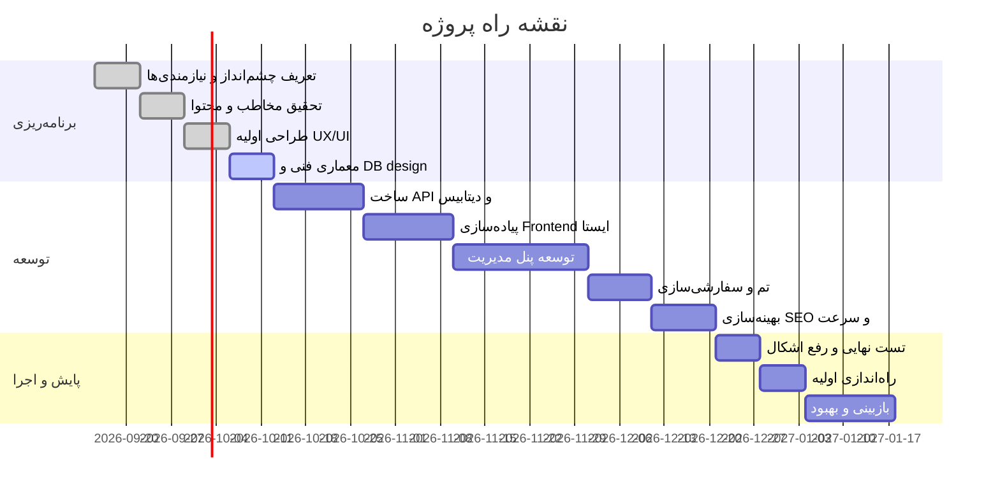

# خلاصه اجرایی

این پروژه با هدف ساخت یک «موتور سایت مشاوره مالی/عملیاتی چندسایته» (Consulting Website Core) طراحی شده که بتواند به سرعت سایت‌های مستقل برای مشاوران مختلف (نخستین آنها جواد دومانلو) تولید کند. مزیت اصلی این رویکرد، صرفه‌جویی در زمان و منابع توسعه است؛ به‌طوری‌که با یک هسته کلی و پنل مدیریت، تنها با به‌روزرسانی محتوا، رنگ‌ها و تم می‌توان سایت جدید ساخت. در ایران، خدمات مشاوره مالی معمولا شامل **کنترل نقدینگی، بودجه‌ریزی، تحلیل سودآوری، گزارش‌های مدیریتی، کنترل هزینه و بهبود فرایندها** می‌شود. این Core باید از ابتدا قابلیت‌هایی مانند تعریف خدمات مبتنی بر مسئله (نه فقط لیست ساده)، جذب مشتری (فرم درخواست مشاوره/ریدر), و نشانه‌های اعتماد (Case Study, Testimonials) را در بر داشته باشد. همچنین برای بهینه‌سازی SEO و سرعت، معماری با React/Next.js و رندر سمت سرور در نظر گرفته می‌شود. 

طراحی این سیستم پیچیده است و نیاز به برنامه‌ریزی دقیق دارد. باید مدل‌های داده جامع تعریف شوند (مانند Tenant, User, Service, Article و …) تا بتوان بدون تغییر کد، چندین سایت را میزبانی کرد. همچنین لازم است ویژگی‌هایی مانند تغییر رنگ و تم، ساختار صفحات ماژولار، و سیستم مدیریت محتوا و SEO در پنل مدیریت پیش‌بینی شود. این طرح علاوه بر مزایای کارایی و یکنواختی برند، چالش‌هایی مانند پیچیدگی هسته، نگهداری داده چندسایته و تضمین عملکرد/امنیت را دارد. در ادامه تحلیل بازار ایران، اولویت قابلیت‌ها، طراحی داده و معماری، و نقشه راه فازبندی‌شده آورده می‌شود.

## تحلیل بازار و رقبا

- **خدمات پرتکرار:** در ایران اغلب شرکت‌های مشاوره مالی حوزه‌های متنوعی را در بر می‌گیرند: **بودجه و پیش‌بینی، نقدینگی، تحلیل سودآوری و هزینه، گزارش‌های مدیریتی، کنترل داخلی و بهای تمام‌شده**. مثلا مرکز مشاوره اقتصادی ایرانیان، روی «شفافیت تصمیم‌های اقتصادی»، «مدیریت ثروت» و «تحلیل ریسک و فرصت» تمرکز دارد. اما بسیاری از رقبای بزرگ خدمات حسابداری، مالیاتی و حتی بیمه را هم عرضه می‌کنند که برای جایگاه ما مناسب نیست. 
- **زبان و محتوا:** سایت‌های ایرانی معمولا محتوایی معطوف به وظایف حسابداری ارائه می‌دهند و با کلیدواژه‌هایی مانند «مشاوره مالی»، «نقدینگی»، «گزارش مدیریتی» دیده می‌شوند. برای Core ما، مهم است که خدمات را با زبان مسئله‌محور (Problem-Solution) بیان کنیم؛ مثلا «چرا سود کم است؟ چگونه جریان نقدی را بهبود دهیم؟» به جای توضیح صرفا خدمت. بازدیدکننده باید در چند ثانیه اول بفهمد این سایت چه مشکلی را حل می‌کند. 
- **نقاط قوت رقبا:** تعدادی سایت خوب (مثل مرکز مشاوره اقتصادی ایرانیان) تجربه کاربری قوی، اعتمادسازی (معرفی مشاور، سوابق، نتایج) و عملکرد پیشرفته ارائه کرده‌اند. استفاده از فرم‌های تماس منظم، تستیمونیال (دیدگاه مشتریان) و Case Study (مثال واقعی پروژه) در بازار به چشم می‌خورد. همچنین برخی از سایت‌ها، جستجوی پیشرفته، فیلتر خدمات و قیمت جلسات را ارائه می‌دهند (مانند سایت مشیرین). 
- **فرصت‌ها:** مدل چندسایته ما می‌تواند نقص رقبا را برطرف کند. یعنی به جای اینکه هر مشاور یک سایت جدید و تکراری بسازد، با تغییر تنظیمات Core سایت‌های جدید راه‌اندازی کنیم. این هسته باید به گونه‌ای طراحی شود که امکانات لازم را برای انواع خدمات مشاوره (مالی، عملیاتی، کسب‌وکار) فراهم آورد و در عین حال سبک و ظاهر منحصر به فرد برای هر مشاور داشته باشد. 

## مخاطبان هدف و نیازها

- **کاربران اصلی:** صاحبان کسب‌وکار کوچک/متوسط، مدیران عامل، مدیران مالی و تصمیم‌گیرندگان سازمانی هستند که اطلاعات مالی و عملیاتی در دسترس دارند ولی از آن برای تصمیم‌گیری دقیق استفاده نمی‌کنند. به‌ویژه شرکت‌های تولیدی، پیمانکاری، خدماتی و بازرگانی که در بازار رقابتی مشکل نقدینگی، هزینه‌های بالا یا سردرگمی در گزارش‌های مالی دارند.
- **نیازها و نقاط درد:** این افراد معمولا مشکلات مشخصی دارند که سایت باید در عناوین کلیدی به آن بپردازد:  
  - «چرا با فروش بالا باز هم نقدینگی کافی نداریم؟»  
  - «کدام مشتریان یا محصولات واقعا سودآورند؟»  
  - «چگونه بودجه صحیح برای سال آینده تنظیم کنیم؟»  
  - «گزارش‌های مالی که داریم چطور به تصمیم مدیریتی تبدیل شوند؟»  
  - «چطور هزینه‌های پنهان را کنترل کنیم؟»  
این موارد به جای تمرکز روی خدمت (مثلا «مدیریت نقدینگی») باید در لایه محتوا مطرح شوند و نشان دهیم راهکار عملی داریم. برای نمونه، یک بخش مشکل می‌تواند سوالاتی مانند «بودجه شرکت چرا محقق نشد؟» یا «سودآوری پروژه‌ها چگونه افزایش یابد؟» را مطرح کند و سپس خدمات مربوط (تحلیل انحراف بودجه، بررسی هزینه‌ها) را ارائه دهد.
- **فرآیند تصمیم:** مخاطب معمولا ابتدا اطلاعات محدودی دارد و دنبال اطمینان از توانایی مشاور است. مراحل مسیر مشتری (User Journey) به صورت زیر است:  
  1. **شناسایی مشکل:** بازدیدکننده سوال یا مشکل خود را می‌بیند (مثلاً «کدام محصول سودآور است؟»).  
  2. **ارائه راهکار:** سایت توضیح می‌دهد که چگونه با تحلیل اطلاعات مالی و عملیاتی راه‌حل می‌دهد.  
  3. **اعتمادسازی:** رزومه مشاور، پروژه‌های موفق (Case Study)، نظرات مشتریان (Testimonial) و مدارک معتبر نمایش داده می‌شود.  
  4. **اقدام:** دعوت به تماس یا درخواست جلسه مشاوره مشخص و ساده است (فرم تماس روشن).  
   
کلام کلیدی در محتوا باید «تصمیم‌گیری بهتر با استفاده از داده‌های مالی و عملیاتی» باشد. برای مثال، عنوان اصلی سایت اول می‌تواند «تصمیم‌های مالی مهم خود را با مشاوره تخصصی مالی و عملیاتی جواد دومانلو دقیق‌تر بگیرید» باشد. 

## اولویت‌بندی قابلیت‌ها (MVP)

با توجه به هدف محصول (Core تکثیرپذیر) و سایت اول (جواد دومانلو)، قابلیت‌ها به دو دسته ضروری (MUST) و قابل توسعه تقسیم می‌شوند. جدول زیر اولویت MoSCoW را نشان می‌دهد:

| قابلیت / Feature                        | MUST (ضروری)                                           | SHOULD (قابل توسعه)                          | COULD / آینده‌پذیر         | WON’T (خارج از فاز اول)       |
|-----------------------------------------|------------------------------------------------------|---------------------------------------------|-----------------------------|-------------------------------|
| **مدیریت چندسایته (Multi-Tenant)**       | اشتراک دیتابیس با فیلد tenantId (مقیاس‌پذیری پایه) | دیتابیس مجزا برای هر سایت (برای افزایش ایزولاسیون) |                            |                               |
| **تعریف مشاور (Consultant Profile)**   | نام، عنوان، بیوگرافی، تصویر حرفه‌ای                 | مدارک، گواهینامه‌ها، مشتریان شاخص             | نمایش رزومه PDF          |                               |
| **مدیریت خدمات (Services)**             | افزودن/ویرایش عنوان و توضیح خدمات (متن کوتاه و کامل)  | دسته‌بندی خدمات، پیوند به صفحه‌های مرتبط        | ویرایش گرافیکی (drag/drop)   |                               |
| **مدیریت صفحات و بخش‌ها (Pages/Sections)** | صفحات ثابت: خانه، درباره، خدمات، مقالات، تماس        | فعال/غیرفعال کردن بخش‌ها (Hero، پروژه‌ها، FAQ) | ویرایش لایه (layout) | Page Builder کامل (Elomentino) |
| **مدیریت محتوا (مقالات و Case Study)**   | CRUD مقالات با عنوان، محتوا، دسته‌بندی، تصویر ویژه    | افزودن Case Study با ساختار مشخص (موقعیت قبل/بعد) | نظرات تخصصی (Expert Opinions) |                               |
| **فرم تماس و لیدها**                    | فرم ساده تماس و مشاوره (نام، ایمیل، پیام) و ذخیره Lead | فرم پیشرفته شامل صنعت، نوع مشاوره، توانایی زمان‌بندی | تقویم/نوبت‌دهی آنلاین    | CRM کامل                       |
| **تم و رنگ‌بندی (Theme/Colors)**         | انتخاب رنگ اصلی و فرعی، لوگو، فونت و قالب کلی         | چند تم از پیش‌تعریف‌شده                     | تم‌ساز پیشرفته (شخصی‌سازی عمیق) |                               |
| **مدیریت رسانه (Media)**                | آپلود تصویر/فایل و استفاده در صفحات و مقالات           | مدیریت کتابخانه چندرسانه‌ای (folder)         | ویرایش تصویر ساده در پنل     |                               |
| **SEO و تنظیمات (SEO/Settings)**        | تنظیم متا تگ‌ها (title، description)، robots.txt       | سایت‌مپ اتوماتیک، اوپن‌گراف، اسکیما            | انتشار اتوماتیک در Search Console |                                |
| **پنل مدیریت (Admin UI)**              | داشبورد خلاصه، احراز هویت JWT، CRUD برای موجودیت‌ها     | داشبورد آمار بازدیدها و لیدها، نقش‌ها (Role)   | نسخه موبایل پنل            |                               |
| **امنیت و عملکرد (Security/Performance)** | HTTPS حتمی، محافظت از XSS/CSRF، محدودیت نرخ درخواست     | CDN برای استاتیک‌ها (مثلا Cloudflare/Arvan)   | تست نفوذ (Pentest)         |                               |

**RICE Score (نمونه):** برای نمونه جدول RICE می‌توان پارامترهای Reach, Impact, Confidence, Effort را محاسبه کرد تا اولویت‌ها مشخص شود. به عنوان مثال، امکان «اشتراک دیتابیس با tenantId» هزینه کم و تأثیر بالا دارد (به راحتی مقیاس‌پذیری اولیه را فراهم می‌کند)، در حالی که «صفحه‌ساز گرافیکی» هزینه زیادی داشته و اولویت پایینی دارد. این جدول در برنامه‌ریزی موارد بعدی مفید خواهد بود.

## مدل داده و موجودیت‌ها

### مدل داده (Data Model)

پرونده‌های اصلی دیتابیس (Collections) با کلیدهای مهم به‌طور خلاصه:

- **Tenant:** شناسه یکتا، نام سایت/مشاور، دامنه (subdomain یا custom domain)، تنظیمات عمومی (لوگو، نشانی پایه).  
- **User:** شناسه، tenantId (ارجاع Tenant)، نام، ایمیل، هش رمز عبور، نقش (Role)، تاریخ ایجاد/آخرین ورود.  
- **Role:** شناسه، نام (مثال: SuperAdmin، SiteAdmin، Editor) و دسترسی‌ها (Permissions).  
- **Consultant (مشاور):** tenantId، نام کامل، عنوان شغلی، بیو کوتاه، بیو بلند، تصویر پروفایل، حوزه‌های تخصص، سال‌های تجربه، تحصیلات/گواهینامه‌ها (اختیاری)، لینک شبکه‌های اجتماعی.  
- **Service (خدمت):** tenantId، عنوان، شرح کوتاه، شرح کامل، تصویر مرتبط، مشکلات مرتبط (Problem)، فواید (Benefits)، خدمات مرتبط (if multi-category)، دسته (اختیاری)، وضعیت (فعال/غیرفعال).  
- **Page (صفحه):** tenantId، slug (مثلا “home” یا “contact”), عنوان صفحه، ترتیب، تنظیمات نمایش (مثلا شامل Header/Footer یا خیر).  
- **Section (بخش):** pageId (ارجاع به Page)، نوع (Hero, About, Services, Testimonials, FAQ, ContactForm, etc)، محتوا (متن و/یا ارجاع به دیتاهای مرتبط)، ترتیب. مثال: یک ServiceSection که فهرستی از خدمات نشان می‌دهد.  
- **Article (مقاله):** tenantId، عنوان، slug، خلاصه (excerpt)، متن کامل، تصویر شاخص، نویسنده (ارجاع کاربر یا متن آزاد)، دسته‌بندی، برچسب‌ها، تاریخ انتشار، تاریخ بروزرسانی، SEO (title/meta)، وضعیت (پیش‌نویس/منتشرشده).  
- **CaseStudy (مطالعه موردی):** tenantId، عنوان پروژه، صنعت، مشکلات قبل از مشاوره، راهکار داده شده، نتایج کمی (درصد سود/کاهش هزینه)، تصاویر پروژه، تاریخ انجام.  
- **Testimonial (نظرات مشتری):** tenantId، نام مشتری، سمت، متن نظر، تصویر مشتری (اختیاری)، وضعیت (فعال).  
- **FAQ:** tenantId، سوال، جواب، درگاه (صفحه یا دسته مرتبط).  
- **Media:** tenantId، آدرس فایل (URL)، نوع (تصویر/ویدئو/سایر)، alt text، اندازه.  
- **Lead (سرنخ):** tenantId، نام مخاطب، شماره تماس، ایمیل، شرکت (اختیاری)، پیام/نیاز، منبع (مثلا form or chat)، تاریخ ایجاد، وضعیت (جدید/تماس گرفته‌شده/از دست رفته...).  
- **ConsultationRequest (درخواست مشاوره):** tenantId، اطلاعات تماس، نوع مشاوره درخواستی، زمان ترجیحی (اختیاری)، توضیحات، وضعیت.  
- **Theme (تم):** tenantId، رنگ‌های اصلی و فرعی (کدهای هگز)، فونت‌ها، تنظیمات تایپوگرافی (هدرها، پاراگراف)، شعاع حاشیه‌ها، استایل دکمه‌ها.  
- **SEOSetting:** tenantId، pageSlug (یا global)، meta title، meta description، robots، openGraph (عنوان/عکس)، استراکچردیتا (Schema JSON-LD)، canonical.  
- **SiteSettings:** tenantId، لوگو (تصویر)، آیکون سایت، اطلاعات تماس (آدرس، تلفن، ایمیل)، لینک شبکه‌های اجتماعی، حقوق مولف (Footer)، و سایر تنظیمات عمومی.

### روابط کلیدی

- هر **سرویس، مقاله، CaseStudy، FAQ** متعلق به یک **مشاور/سایت (tenant)** مشخص است (فیلد tenantId).  
- یک **صفحه (Page)** شامل یک یا چند **بخش (Section)** است که محتوای آنها قابل مدیریت است (مثلاً صفحه اصلی می‌تواند HeroSection، ServicesSection، AboutSection و غیره داشته باشد).  
- مقالات و CaseStudyها می‌توانند به خدمات مرتبط لینک شوند (مثلاً یک مقاله با خدمت «مدیریت نقدینگی» مرتبط است).  
- **Lead** و **ConsultationRequest** مرتبط به همان tenant هستند و در پنل مدیریت می‌توان بر اساس آنها دنبال‌یابی کرد.  
- **Role** برای کنترل دسترسی در **پنل مدیریت** استفاده می‌شود.

下面 یک دیاگرام Mermaid برای نمایش روابط داده می‌آوریم:

## پنل مدیریت (Admin Panel)

پنل مدیریت باید برای کاربران غیرفنی و مدیران سایت قابل فهم باشد. ساختار پیشنهادی:

- **داشبورد:** خلاصه آمار کلی (تعداد بازدیدها، تعداد لیدها، وضعیت مقالات/خدمات).  
- **مدیریت محتوای سایت:** شامل زیرمنوها برای هر بخش:
  - **مشاور (Consultant):** ویرایش نام، عکس، بیوگرافی و مشخصات فرد مشاور.  
  - **خدمات (Services):** CRUD برای خدمات، تعیین اولویت یا آیکون مرتبط.  
  - **مقالات (Articles):** لیست مقالات با فیلتر/جستجو، ایجاد و ویرایش مقاله (با ویرایشگر متنی غنی).  
  - **مطالعات موردی (Case Studies):** افزودن پروژه‌های نمونه و نتایج.  
  - **نظرات مشتریان (Testimonials):** افزودن و مدیریت دیدگاه‌های مشتریان.  
  - **سوالات متداول (FAQs):** گروه‌بندی شده یا کلی.  
  - **تصاویر و فایل‌ها (Media):** آپلود و درج در محتوا.  
- **سفارشی‌سازی ظاهر (Appearance):**
  - **تم (Theme):** انتخاب قالب از لیست (Color Scheme، فونت‌ها).  
  - **رنگ‌ها:** پنل انتخاب رنگ برایPrimary/Secondary و رنگ‌های متنی/پس‌زمینه (با پیش‌نمایش زنده).  
- **تنظیمات سایت (Settings):** شامل مواردی مثل:
  - **اطلاعات تماس و شبکه‌های اجتماعی:** وارد کردن آدرس، تلفن، لینک‌ها.  
  - **SEO:** تنظیم عنوان و توضیحات متا برای صفحات کلیدی (خانه، خدمات، مقالات)، مدیریت robots.txt.  
  - **تنظیمات عمومی:** زبان (فارسی)، لوگو، آیکون، انتخاب دامنه/subdomain.  
- **مدیریت کاربران (Users):** ایجاد حساب کاربری جدید برای مدیر سایت، تعیین نقش و سطح دسترسی (مثلا SuperAdmin تنها برای خودت).  
- **Lead Management:** مشاهده لیدهای ثبت‌شده، تغییر وضعیت پیگیری.  
- **ثبت فعالیت (Logs):** لاگ تغییرات مهم (اختیاری).  
- **امنیت:** فرم تغییر رمز عبور، ورود دو مرحله‌ای (اختیاری).

صفحات ادمین باید واکنشگرا باشند و برای موبایل و تبلت نیز بهینه شوند. از فریمورک‌هایی مانند Ant Design یا Material UI (با تم سفارشی) برای اجزا استفاده شود تا نیاز به تولید کامپوننت از صفر نباشد.

## سیستم تم و طراحی (Theme)

هسته سیستم تم باید به‌گونه‌ای طراحی شود که کاملا از محتوا جدا باشد. توصیه می‌شود از **Design Tokens** برای رنگ‌ها، تایپوگرافی و فاصله‌ها استفاده شود. به عنوان مثال: 

- **رنگ‌ها:** تعریف متغیرهایی مانند `primary`, `secondary`, `text`, `background` و… (مثلا در CSS Variables یا Tailwind config).  
- **تایپوگرافی:** تعیین مجموعه فونت‌ها و وزن‌های متنی (مثلا H1,H2,Paragraph) که در تم مصرف شوند.  
- **فاصله‌بندی:** سیستم فاصله (Spacing scale) مشخص شود (مثل پدینگ‌های یکنواخت).  
- **کامپوننت‌ها:** اجزایی مثل Button, Card, Navbar, Footer, Form, Heading باید دارای حالت (variant) باشند. مثلا یک Button ممکن است الگوهای primary, secondary, outline داشته باشد.  
- **Dark/Light Mode (اختیاری):** می‌توان در مراحل بعد تاریک/روشن اضافه کرد.  

هر تم می‌تواند شامل پالت رنگ و تنظیمات متفاوت باشد. مثلا «تم کلاسیک» با رنگ‌های سرمه‌ای و طلایی و «تم مدرن» با آبی و خاکستری. تغییر تم در پنل ادمین کافیست تا استایل کل سایت تغییر کند. این جداسازی باعث می‌شود محتوا و کامپوننت‌ها وابسته به تم نباشند و در هنگام تغییر کاملاً پویا عمل کنند. 

## استراتژی SEO و سئو

برای سایت مشاوران، **SEO بسیار حیاتی** است. به‌خصوص در ایران که عبارات فارسی مانند «مشاور مالی شرکت» یا «گزارش مدیریتی چیست» سرچ می‌شوند. موارد کلیدی:

- **رندر سمت سرور (SSR/SSG):** استفاده از Next.js یا Nuxt.js پیشنهاد می‌شود. Google توصیه کرده SSR یا پیش‌رن‍درینگ را مد نظر قرار دهیم، چون سایت را سریع‌تر می‌کند و همه ربات‌ها نمی‌توانند جاوااسکریپت را اجرا کنند. معماری MERN-SPA بکر ممکن است ایندکس کامل محتوا را به تأخیر بیندازد. به همین دلیل Next.js با SSG یا ISR گزینه اول است.  
- **متا و اسکیما:** برای هر صفحه کلیدی باید `<title>`, `<meta name="description">`, Canonical و تگ‌های Open Graph تنظیم شوند. همچنین بهتر است از داده‌های ساخت‌یافته (Structured Data) Schema.org استفاده شود: مثلا `FinancialService` یا `Consultant`, `Person`, `LocalBusiness` و `Breadcrumb` برای سازمان‌دهی بهتر در نتایج جستجو. این کار به نمایش بهتر (rich snippets) کمک می‌کند.  
- **آدرس (URL) بهینه:** استفاده از دامنه .ir یا .com فارسی و مسیرهای SEO-Friendly (مثلا `/services/budgeting`, `/blog/budgeting-tips`).  
- **سایت‌مپ و robots:** تولید خودکار فایل Sitemap.xml و robots.txt برای هر سایت، و امکان بروزرسانی آنها از پنل.  
- **محتوای بهینه:** کلیدواژه‌های فارسی مرتبط با مشکلات واقعی مدیران (مثلاً «بودجه شرکت»، «تحلیل نقدینگی» ) باید در عناوین و متن‌ها استفاده شوند. مقالات، عناوین سرویس و سؤال‌ها (FAQ) با این کلمات کلیدی بهینه شوند.  
- **محلی‌سازی:** تمام محتوا فارسی و راست‌به‌چپ است. در طراحی متا-اطلاعات و برچسب‌ها این نکته رعایت شود.  
- **سرعت بارگذاری:** برای سئوی بهتر به Core Web Vitals توجه شود (LCP <2.5s, INP <200ms, CLS <0.1). بهینه‌سازی تصاویر (WebP/AVIF), lazy load, Cache-Control و CDN برای منابع استاتیک به کار رود.  

## عملکرد و امنیت

- **عملکرد:** حجم صفحات باید کم شود: استفاده از فشرده‌سازی gzip/deflate، CDN (مثلا Cloudflare یا سرویس‌های ایرانی مانند ArvanCDN)، بهینه‌سازی تصاویر (ابعاد صحیح و فشرده‌شده) ضروری است. فایل‌های استاتیک (JS/CSS) باید تا حد امکان Minify و Cache شوند. React/Next همراه با تکنیک Code Splitting و SSR کمک بسیاری می‌کند.  
- **امنیت:** احراز هویت JWT با Refresh Tokens پیاده‌سازی شود. همه ورودی‌ها در API اعتبارسنجی و پاکسازی شوند تا XSS/SQL Injection رخ ندهد. تنظیم CORS صحیح و استفاده از HTTPS (SSL/TLS) حتمی است. محدودیت نرخ (Rate Limiting) برای API پیشنهاد می‌شود. لاگ‌گیری از فعالیت‌های حساس (ورود/خطا) و بکاپ دوره‌ای از دیتابیس در نظر گرفته شود.  
- **حریم خصوصی:** اگر داده‌ی حساس (مثلاً ایمیل یا تلفن) ذخیره می‌شود، اطلاع‌رسانی حفظ حریم (Privacy Notice) و نظر به قوانین مربوطه مد نظر باشد. برای شرکت‌های ایرانی، توصیه می‌شود الزامات «قانون تجارت الکترونیک» رعایت شود (مثلاً نمایش اطلاعات هویت مدیران سایت در فوتر).

## رویکرد چندسایته (Multi-Tenancy)

برای مقیاس‌پذیری، از ابتدا مدل چندسایته پیاده می‌کنیم. دو رویکرد اصلی وجود دارد:  
- **یک دیتابیس مشترک برای همه سایت‌ها (Tenant مشترک):** هر سند در کالکشن‌ها دارای فیلد `tenantId` است. این ساده‌تر و مقیاس‌پذیر است (برای تعداد نامحدود سایت) و نگهداری‌اش آسان‌تر است. اما باید در تمام کوئری‌ها ملاک `tenantId` اعمال شود تا جداسازی داده تضمین شود.  
- **دیتابیس مجزا برای هر سایت:** امنیت بالاتری فراهم می‌کند و امکان ایزولاسیون کامل. اما هزینه منابع بیشتر، پیچیدگی در نگهداری و کار با بکاپ و مانیتورینگ دارد. برای تعداد سایت کم در فاز اولیه ممکن مناسب باشد، اما برای مقیاس بالاتر روند سخت‌تری دارد.

پیشنهاد ما در V1 استفاده از **دیتابیس مشترک با جداکننده tenantId** است؛ چون در ایران احتمالاً تعداد سایت‌ها در ابتدا اندک است ولی در آینده ممکن رشد یابد. این رویکرد مطابق راهنمای MongoDB است که برای ساختار داده یکسان بین سایت‌ها مقیاس‌پذیری بالایی دارد. در صورت نیازهای امنیتی خاص می‌توان بعدها به معماری دیتابیس مجزا تغییر داد. الگوی معمول این است که هر کوئری و CRUD با شرط `where tenantId = currentTenantId` صورت گیرد.

### ساختار زیر دامنه‌ها

هر سایت می‌تواند زیر دامنه‌ای مانند `javad.domain.com` یا دامنه اختصاصی خود (مثلا javad-domanlou.ir) داشته باشد. در تنظیمات هر Tenant می‌توان دامنه مرتبط را ثبت کرد تا درخواست‌ها براساس Host header به Tenant مربوطه متصل شوند.

## طراحی API

API به سبک RESTful یا GraphQL توصیه می‌شود (اینجا REST را مثال می‌زنیم). از پسوند `/api/v1` استفاده می‌شود تا نسخه‌بندی ممکن باشد. مثال‌های زیر ساختار پیشنهادی را نشان می‌دهد:

- **Auth:** `POST /api/v1/auth/login` (دریافت JWT), `POST /api/v1/auth/refresh` (توکن تازه)  
- **Users/Roles:** `GET /api/v1/users` (فهرست کاربران), `POST /api/v1/users` (ایجاد کاربر), `PUT /api/v1/users/:id`, `DELETE /api/v1/users/:id` (فقط برای سوپرادمین). مشابه `/api/v1/roles`.  
- **Consultant:** `GET /api/v1/consultant` (اطلاعات ثابت مشاور سایت فعلی), `PUT /api/v1/consultant` (ویرایش).  
- **Services:** `GET /api/v1/services`, `POST /api/v1/services`, `PUT /api/v1/services/:id`, `DELETE /api/v1/services/:id`.  
- **Pages/Sections:** `GET /api/v1/pages`, `GET /api/v1/pages/:id`, `PUT /api/v1/pages/:id`, و برای بخش‌ها `/api/v1/pages/:pageId/sections`.  
- **Articles:** `GET /api/v1/articles?published=true&page=1`, `POST /api/v1/articles`, ویرایش و حذف.  
- **Case Studies, Testimonials, FAQs:** مشابه مقالات.  
- **Media:** `POST /api/v1/media/upload`, `GET /api/v1/media/:id`, `DELETE /api/v1/media/:id`.  
- **Leads/Requests:** `GET /api/v1/leads`, `POST /api/v1/leads`, `PUT /api/v1/leads/:id` (تغییر وضعیت).  
- **Theme/Settings:** `GET /api/v1/theme`, `PUT /api/v1/theme` (دریافت و ذخیره تنظیمات رنگ/فونت)، و `GET/PUT /api/v1/settings` برای اطلاعات تماس و SEO.  

در همه درخواست‌ها احراز هویت JWT (با Bearer token) لازم است، مگر موارد عمومی (مقالات منتشرشده). اعتبارسنجی سمت سرور (Zod یا Joi) باید انجام شود. هندل خطاها (ValidationError, AuthError) با کد مناسب HTTP (مثل 400,401,403) برگردانده شود.

## استقرار و زیرساخت

- **هاستینگ:** می‌توان از سرور مجازی یا Platform داخلی مانند نت‌افزار، پارس‌پک یا سرور اختصاصی داخلی استفاده کرد تا تأخیر شبکه کمتر باشد. اگر سرویس ابری خارجی (مثل AWS/GCP) انتخاب شود، با توجه به فیلترها باید CDN داخلی (Cloudflare یا ArvanCloud) روبروی آن قرار گیرد.  
- **CDN:** استفاده از CDN برای فایل‌های استاتیک (CSS, JS, تصاویر) ضروری است. ArvanCDN به‌خوبی در ایران عمل می‌کند. همچنین، تصاویر در Cloud Storage ذخیره شده و توسط CDN سرو می‌شوند (مثلاً Arvan Object Storage یا AWS S3 + CloudFront).  
- **SSL/TLS:** گواهی‌نامه SSL رایگان (Let’s Encrypt) یا خریداری برای هر دامنه و subdomain سایت‌ها.  
- **پایگاه‌داده:** MongoDB Atlas یا سرویس داخلی مانند MongoDB مناسب خواهد بود. در صورت لزوم، می‌توان مستقیماً کلود ایران مانند هلوسنس را در نظر گرفت. (بهره از اشتراک MongoDB موارد امنیتی را کاهش می‌دهد.)  
- **CI/CD:** تنظیم یک خط لوله CI (مثلاً GitHub Actions) برای تست و دیپلوی خودکار به محیط استیج و تولید.  
- **لاگ و مانیتورینگ:** اتصال به ابزارهای لاگ‌گیری (مثلا Logstash, Prometheus) و Uptime Tracker. 

## مهاجرت و نسخه‌بندی

- **نسخه‌بندی دیتابیس:** با توجه به تغییرات احتمالی اسکیمای دیتابیس، از Migrations استفاده شود (مثل `migrate-mongo` یا تغییرات در Mongoose Schema) تا داده‌ها به‌روزرسانی شوند.  
- **مدیریت نسخه هسته:** کد Core را در گیت نسخه‌بندی کنید. برای هر ریلیز (مثلاً v1.0, v1.1) مستند تغییرات ثبت شود و سایت‌های فعلی بتوانند به‌روزرسانی تدریجی بگیرند. اگر تغییرات شکسته‌کننده بود، از Feature Flags یا نسخه جدید API استفاده کنید.  
- **داده سایت:** هنگام ایجاد یا به‌روزرسانی سایت‌های مختلف، باید داده‌های جدید را به دیتابیس اضافه/به‌روزرسانی کرد. بهتر است امکان Export/Import محتوای سایت‌ها (مثلاً JSON Dump) فراهم باشد تا در آینده تسهیل مهاجرت یا نسخه‌برداری از یک سایت به سایت دیگر انجام شود.

## برنامه‌ آزمون (Testing)

- **واحد (Unit Tests):** برای بخش‌های کلیدی مانند اعتبارسنجی دیتابیس و منطق بیزینس (مثلا محاسبه درصد بودجه) از Jest یا Mocha استفاده شود.  
- **یکپارچه‌سازی (Integration Tests):** تست API‌ها با ابزارهایی مثل Supertest یا Postman Collections.  
- **UI/UX:** تست کاربری اولیه برای اطمینان از سادگی پنل مدیریت. بررسی رسپانسیو بودن صفحات با Lighthouse یا [Google Mobile-Friendly Test].  
- **بارگذاری (Load Testing):** با تعداد فرضی کاربران وب (مثلا 100 همزمان) و بررسی تاثیر کش و CDN.  
- **Security:** یک بررسی ساده XSS/CSRF و تست اعتبارسنجی JWT.  

## نقشه راه (Roadmap)

یک نقشه راه فازی توصیه می‌شود تا پس از تأیید طرح، مرحله‌به‌مرحله پیش برویم. جدول زیر پیشنهاد زمان‌بندی تقریبی هر فاز را نشان می‌دهد:

| فاز / Phase              | اهداف و تحویل‌ها                                             | مدت تقریبی |
|--------------------------|-----------------------------------------------------------|-----------|
| **فاز 0: تعریف محصول**    | «چشم‌انداز و نیازمندی‌ها» (این سند 01 کامل)               | 1 هفته    |
| **فاز 1: مخاطبان و محتوا**| تحقیق بیشتر روی مخاطب، فرم‌‌دهی پیام اصلی (سند 02)         | 1 هفته    |
| **فاز 2: طراحی UX/UI**   | طراحی وایرفریم صفحات مهم (Home, About, Services, Contact) | 1 هفته    |
| **فاز 3: معماری فنی**     | رسم دیتابیس و ERD، انتخاب تکنولوژی (This doc)             | 1 هفته    |
| **فاز 4: دیتابیس و API**  | طراحی اسکیمای MongoDB، APIهای پایه، Auth                   | 2 هفته    |
| **فاز 5: Frontend Static**| پیاده‌سازی صفحات ایستا با React/Next.js (بدون محتوا)      | 2 هفته    |
| **فاز 6: پنل مدیریت**     | ایجاد پنل CRUD برای مطالب (React+TypeScript)، فرم‌های ساده | 3 هفته    |
| **فاز 7: تم و سفارشی‌سازی**| پیاده‌سازی سیستم تم (انتخاب رنگ، لوگو)، ماژولار کردن کامپوننت‌ها | 1.5 هفته |
| **فاز 8: SEO/Performance**| تنظیم SSR/SSG، بهینه‌سازی سرعت، افزودن متادیتا و اسکیما      | 1.5 هفته |
| **فاز 9: تست نهایی**      | تست جامع (تست کاربر، تست امنیت) و رفع باگ                 | 1 هفته    |
| **فاز 10: راه‌اندازی اولیه** | لانچ سایت جواد دومانلو، مانیتورینگ                       | 1 هفته    |
| **فاز 11: بررسی و اصلاح**  | بازخورد و اصلاحات به‌موقع Core و سایت                     | 2 هفته    |

## توصیه‌ها و ریسک‌ها

- **بازخورد مداوم:** قبل از پیاده‌سازی همه قابلیت‌ها، نسخه اولیه (MVP) سایت جواد دومانلو را عرضه کنید و بازخورد واقعی کاربران (همکاران، مدیران) را جمع‌آوری کنید. ممکن است نیازهای جدید یا تغییر اولویت ظاهر شوند.
- **ریسک پیچیدگی:** ساخت سیستم چندسایته ماژولار پیچیده است. برای مدیریت این ریسک، از همان ابتدا روی معماری کل تمرکز کنید و از افزونه‌ها/کتابخانه‌های استاندارد استفاده کنید (مثلا Mongoose برای مدل‌ها، Passport/JWT برای Auth).
- **امنیت داده‌ها:** چون اطلاعات شرکت‌ها به اشتراک گذاشته می‌شود، ریسک نشت داده وجود دارد. حتما HTTPS اجباری باشد و دسترسی‌ها دقیق کنترل شود. 
- **به‌روزرسانی‌های آینده:** هرگونه تغییر عمده در Core (مثلا تغییر حوزه Servies یا طرح پنل) می‌تواند به کل سایت‌ها سرایت کند. بنابراین از مدیریت نسخه (Version Control) و شناسنامه API استفاده کنید. 
- **هزینه نگهداری:** پیچیدگی بیشتر هسته به معنی هزینه نگهداری بالاتر است. اگر چه فاز اول پرهزینه خواهد بود، اما در درازمدت چندین برابر صرفه‌جویی ایجاد می‌کند. برای کنترل هزینه، فازها را تعریف‌شده اجرا و از اضافه‌کاری‌های غیرضروری بپرهیزید.
- **مقیاس‌گذاری:** در آینده که تعداد سایت‌ها زیاد شد، ممکن لازم شود به معماری دیتابیس مجزا (هر سایت یک دیتابیس) مهاجرت کنید. این را از ابتدا در نظر داشته باشید و لاجیک جداسازی داده‌ها را کاملا از سطح برنامه (Application Layer) اجرا کنید. 
- **محتوای اولیه:** برای شروع، باید محتوای اولیه سایت جواد دومانلو آماده شود (متن خدمات، بیوگرافی، مقالات نمونه). این محتوا بهینه (SEO) شود و با زبان یک مدیر ساده نوشته شود تا از ابتدا تجربه کاربری خوبی داشته باشیم.

با این رویکرد مرحله‌بندی‌شده، فرصت داریم تا **هم‌زمان** نسخه اولیه سایت شخصی جواد دومانلو را فعال کنیم و از طریق آن تجربه واقعی از هسته Core را به دست آوریم. در ادامه و پس از بازخورد، هسته را بهبود داده و آماده تولید سایت‌های دیگر خواهیم شد. فراموش نکنیم کلید موفقیت، سازگاری با نیاز واقعی مدیران ایرانی و تمرکز بر حل مسائل مالی/عملیاتی آنهاست.